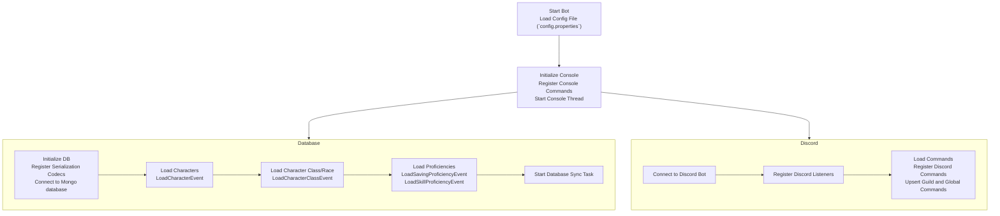

# Lifecycle
This document details the execution of this bot.

## Startup

```mermaid
flowchart TD
	A["Start Bot\nLoad Config File (`config.properties`)"]
	B["Initialize Console\nRegister Console Commands\nStart Console Thread"]
	subgraph C["Database"]
			CA["Initialize DB\nRegister Serialization Codecs\nConnect to Mongo database"]
			CB["Load Characters\nLoadCharacterEvent"]
			CC["Load Character Class/Race\nLoadCharacterClassEvent"]
			CD["Load Proficiencies\nLoadSavingProficiencyEvent\nLoadSkillProficiencyEvent"]
			CE["Start Database Sync Task"]
			CA--->CB--->CC--->CD--->CE
	end
	subgraph D["Discord"]
		DA["Connect to Discord Bot"]
		DB["Register Discord Listeners"]
		DC["Load Commands\nRegister Discord Commands\nUpsert Guild and Global Commands"]
		DA--->DB--->DC
	end
	A--->B
	B--->C
	B--->D
```